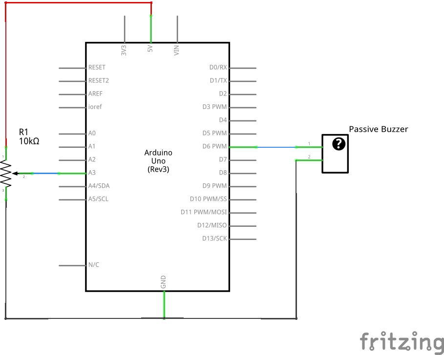

# Buzzer Tone

Control the tone of a passive buzzer using a potentiometer.

## TODO

- How to generate musical notes with a passive buzzer?
- Fritzing doesn't seem to include a part for a simple buzzer?

