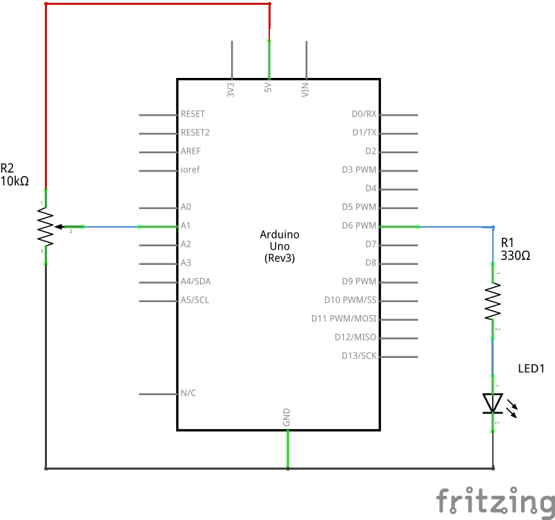

# Dimmable LED

Dim or brighten an LED using a potentiometer.
Also prints the input/output values to the Serial Monitor.

The key takeaway is that `analogRead` values are 10 bits (0 to 1023),
whereas `analogWrite` values are 8 bits (0 to 255).

