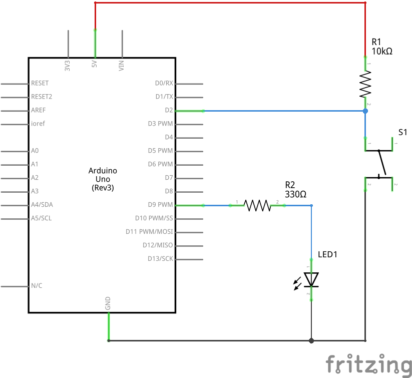

# Pushbutton Toggle

Turn a LED on and off using a pushbutton as a toggle switch.

This demonstrates using a pull-up resistor with a button
to ensure the input voltage is stable when the button is not pressed.

